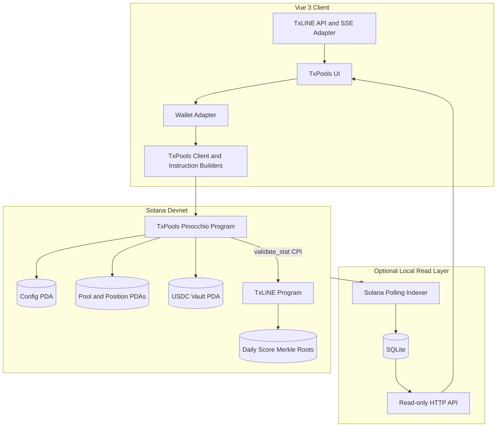
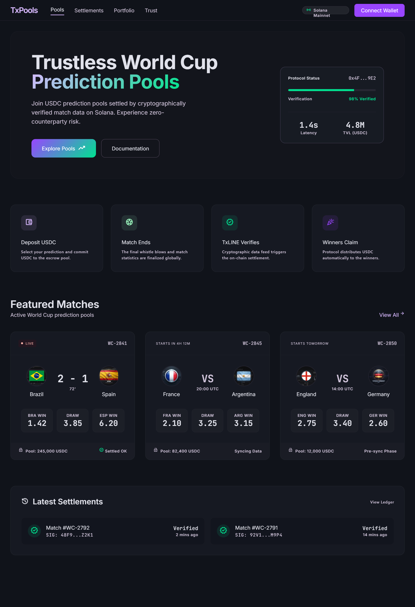
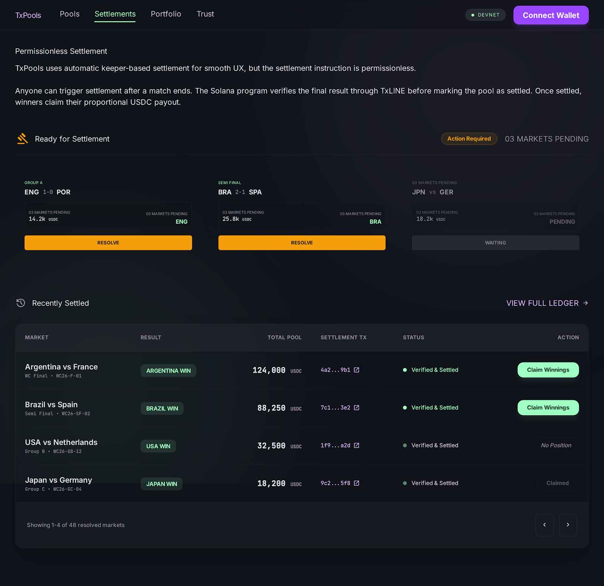

<div align="center">
  
</div>

<div align="center">
  <strong>Trustless World Cup prediction pools settled with TxLINE-verified match data on Solana.</strong>
</div>

<br />

| Devnet deployment | Address |
| --- | --- |
| **TxPools Program ID** | [`txpWnpDSkz98Xgm451KBpezot1YL4FM8LnnUA4Tyfh1`](https://explorer.solana.com/address/txpWnpDSkz98Xgm451KBpezot1YL4FM8LnnUA4Tyfh1?cluster=devnet) |
| **TxLINE Program ID** | [`6pW64gN1s2uqjHkn1unFeEjAwJkPGHoppGvS715wyP2J`](https://explorer.solana.com/address/6pW64gN1s2uqjHkn1unFeEjAwJkPGHoppGvS715wyP2J?cluster=devnet) |
| **Network** | [Solana Devnet](https://explorer.solana.com/?cluster=devnet) |

<div align="center">

[](https://solana.com/)
[](https://github.com/anza-xyz/pinocchio)
[](https://vuejs.org/)
[](https://www.typescriptlang.org/)
[](https://github.com/anza-xyz/mollusk)

</div>

## Overview

TxPools is a complete devnet implementation of a USDC prediction pool protocol for World Cup matches. Users select an outcome, lock USDC before kickoff, and claim a proportional share of the pool after permissionless settlement.

Live fixtures and score events come from the [TxLINE API and SSE feeds](https://txline-docs.txodds.com/). Settlement calls the TxLINE program twice through `validate_stat` CPI to verify the final home and away score values against TxLINE Merkle data before the TxPools program records a winner or releases payouts.

The project includes:

- A polished Vue application with live pools, match details, settlements, portfolio, trust, and authority-only admin views.
- A compact `no_std` Solana program built with [Pinocchio](https://github.com/anza-xyz/pinocchio).
- A local SQLite indexer for fast pool, participant, and wallet-position queries.
- A typed frontend adapter for TxLINE REST/SSE and hand-built TxPools instructions.
- Mollusk integration tests covering the complete pool lifecycle and failure cases.

## Product Flow


## Architecture



The SQLite service is a derived read model only. It never signs transactions, holds user funds, or participates in payout authorization. On-chain PDAs remain the source of truth.

## On-chain Program

The program uses a fixed devnet USDC mint, canonical PDA derivations, checked token transfers, dynamic rent calculation, and a compile-time bootstrap authority for one-time config initialization.

### Instructions

| # | Instruction | Authority | Purpose |
| ---: | --- | --- | --- |
| 0 | `initialize_config` | Bootstrap authority | Creates the global config PDA with admin, fee recipient, and fee basis points. |
| 1 | `initialize_pool` | Config admin | Creates a fixture-specific pool and USDC vault, then funds the 150 USDC platform bonus. |
| 2 | `lock_prediction` | User | Creates or updates a user/outcome position and transfers USDC into the pool vault before close time. |
| 3 | `resolve_pool` | Permissionless signer | Verifies home and away score proofs through TxLINE CPI, records the winner, and computes the payout pool. |
| 4 | `claim_winnings` | Winning user | Transfers the user's proportional payout from the vault and permanently marks the position claimed. |
| 5 | `sweep_unclaimed_pool` | Config admin | Recovers the vault only when a resolved pool has no user funds in the winning outcome. |

### State

| Account | PDA seeds | Stored data |
| --- | --- | --- |
| Config | `['config']` | Admin, fee recipient, fee bps, bump |
| Pool | `['pool', fixture_id_le_u64]` | Fixture, close time, totals, result, fee and payout data, bumps |
| Position | `['position', pool, user, outcome]` | User, pool, outcome, amount, claimed flag, bump |
| Vault | `['vault', pool]` | SPL Token account owned by the pool PDA |

For a winning position, the program calculates:

```text
claim = floor(position_amount * net_payout_pool / winning_outcome_total)
```

The configured platform fee is charged only when the pool has participants and the winning outcome contains user funds. A pool with no user winners pays no platform fee.

## Frontend

| View | Capability |
| --- | --- |
| Home | Product flow, featured World Cup pools, and recent settlements |
| Pools | Live and initialized on-chain pools with score, distribution, status, and payout estimates |
| Match Detail | Outcome selection, wallet balance, countdown/finality state, and `lock_prediction` transaction |
| Settlements | Strict final-status filtering, TxLINE proof preparation, and permissionless `resolve_pool` transaction |
| Portfolio | Wallet-scoped on-chain positions, projected/claimable payouts, and `claim_winnings` transaction |
| Trust | TxLINE, Merkle proof, escrow, and payout architecture |
| Admin | Authority-gated config, pool initialization, bonus funding, and eligible vault sweep transactions |

<details>
<summary><strong>Interface previews</strong></summary>

### Home



### Match Pools


### Settlements



</details>

## Tech Stack

| Layer | Technology |
| --- | --- |
| Frontend | [Vue 3](https://vuejs.org/), [Vite](https://vite.dev/), TypeScript, Vue Router, Tailwind CSS |
| Wallet and client | `solana-wallets-vue`, `@solana/web3.js`, `@solana/spl-token` |
| Live sports data | [TxLINE](https://txline-docs.txodds.com/) REST API, authenticated SSE, Merkle proofs |
| On-chain program | Rust, `no_std`, [Pinocchio](https://github.com/anza-xyz/pinocchio), SPL Token CPI |
| Program tests | [Mollusk SVM](https://github.com/anza-xyz/mollusk), mock TxLINE CPI program |
| Read indexer | Node.js polling service, built-in SQLite, read-only JSON API |

## Repository Layout

```text
.
├── app/
│   ├── backend/                 # SQLite indexer and read API
│   ├── docs/                    # TxLINE and indexer setup guides
│   ├── scripts/                 # TxLINE devnet activation helper
│   └── src/
│       ├── components/          # Reusable product UI
│       ├── composables/         # Pool, admin, and TxLINE state
│       ├── pages/               # Route-level views
│       └── services/            # TxLINE, settlement, and program clients
├── docs/assets/                 # Repository branding
└── programs/
    ├── references/              # Pinocchio reference implementations
    └── txpools/
        ├── src/                 # TxPools program and account state
        └── tests/               # Mollusk lifecycle tests and mock TxLINE program
```

## Local Setup

### Prerequisites

- [Node.js 24](https://nodejs.org/) recommended for the built-in SQLite module used by the indexer.
- [Rust](https://www.rust-lang.org/tools/install) and the [Solana CLI](https://solana.com/docs/intro/installation) to build or test the program.
- A browser wallet configured for Solana Devnet.
- A TxLINE devnet subscription and API credentials.

### 1. Configure the application

```bash
cd app
npm install
cp .env.example .env
```

Generate the TxLINE guest JWT and API token with the included helper:

```bash
npm run txline:devnet
```

Place the generated values in `app/.env`. See [TxLINE Devnet Setup](app/docs/txline-devnet-setup.md) for the complete activation flow.

### 2. Start the indexer

In one terminal:

```bash
cd app
npm run indexer
```

The local API starts at [`http://localhost:8787`](http://localhost:8787). Its health endpoint is [`http://localhost:8787/health`](http://localhost:8787/health). See [SQLite Indexer Documentation](app/docs/txpools-sqlite-indexer.md) for all read endpoints.

### 3. Start the frontend

In another terminal:

```bash
cd app
npm run dev
```

Open the URL printed by Vite, normally [`http://localhost:5173`](http://localhost:5173).

For hosted deployment, use Vercel for the Vue application and Railway for the persistent indexer and authenticated proxies. See the [deployment guide](app/docs/deployment.md).

### 4. Build and test the program

```bash
cd programs/txpools
cargo fmt --check
cargo build-sbf
cargo test
```

The Mollusk suite covers config and pool initialization, authority checks, duplicate prevention, close-time enforcement, token validation, repeated locks, TxLINE resolution, exact payout calculation, losing claims, double claims, and empty-winner vault sweeps.

## Indexer API

| Method | Endpoint | Description |
| --- | --- | --- |
| `GET` | `/health` | Poller and database status |
| `GET` | `/api/pools` | All indexed TxPools pool accounts |
| `GET` | `/api/pools/:fixtureId` | Pool and vault state for one fixture |
| `GET` | `/api/pools/:fixtureId/participants` | Derived unique participant count |
| `GET` | `/api/pools/:fixtureId/positions` | Positions belonging to one pool |
| `GET` | `/api/users/:wallet/positions` | Portfolio positions for one wallet |

Raw USDC values are stored as decimal strings to avoid JavaScript integer precision loss.

## Security and Scope

TxPools is hackathon software deployed on Devnet. It has not received an independent production audit and must not be used with real-value assets.

- Pool funds are held by a PDA-controlled USDC token vault. The indexer and frontend never custody funds.
- Config initialization is restricted to the compile-time bootstrap authority, preventing first-caller admin takeover.
- USDC mint and SPL Token program IDs are fixed and checked by the program.
- Settlement is permissionless and requires two successful TxLINE `validate_stat` CPIs for the submitted fixture and score values.
- The frontend strictly requires a TxLINE final match status before it constructs a settlement transaction.
- **Known TxLINE boundary:** the current on-chain score proof does not itself attest that a match status is final. A direct program caller can bypass the frontend finality gate. This remains an explicit devnet limitation until TxLINE exposes final-status validation on-chain.
- Integer division can leave a small rounding remainder in a vault. Dust recovery is intentionally outside the current hackathon scope.
- Pool cancellation and user refunds are outside the current scope.

## References

- [TxLINE Documentation](https://txline-docs.txodds.com/)
- [TxLINE Documentation Index](https://txline-docs.txodds.com/llms.txt)
- [Solana Program Deployment](https://solana.com/docs/core/programs/program-deployment)
- [Solana Program Derived Addresses](https://solana.com/docs/core/pda)
- [Pinocchio](https://github.com/anza-xyz/pinocchio)
- [Mollusk](https://github.com/anza-xyz/mollusk)
- [Vue 3](https://vuejs.org/)
- [Vite](https://vite.dev/)

---

<div align="center">
  Built for verifiable, non-custodial sports prediction pools on Solana Devnet.
</div>
